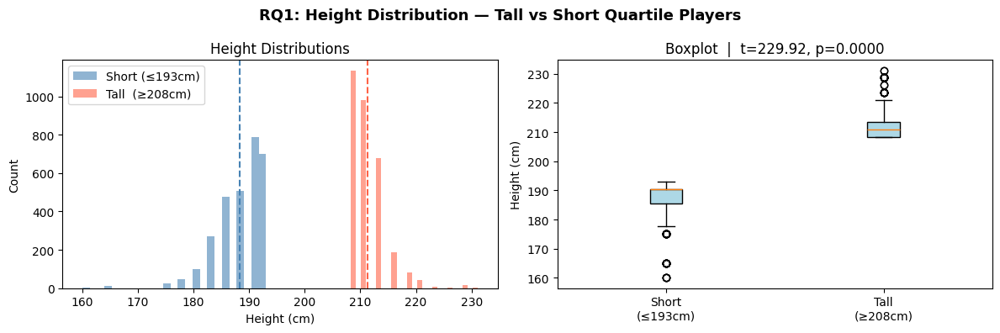
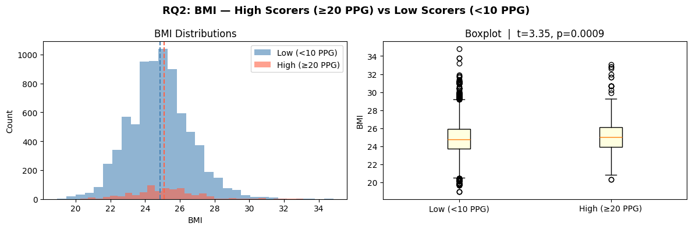
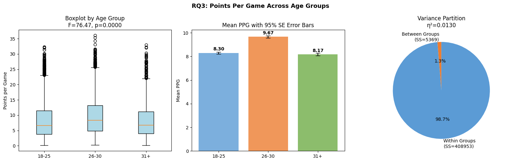

# 🏀 Analyzing the Relationship Between NBA Player Characteristics and Performance

> *Does physical makeup predict who scores in the NBA? We analyzed nearly 30 years of player data to find out.*

**Dataset:** [NBA Players Dataset - Kaggle](https://www.kaggle.com/datasets/justinas/nba-players-data)  
**Seasons Covered:** 1996–97 through 2022–23

---

## Overview

This project investigates whether physical characteristics and age can predict NBA player scoring performance. Using over 12,000 player-season records spanning 27 seasons, we applied rigorous statistical hypothesis testing to answer three research questions:

| # | Research Question | Method |
|---|-------------------|--------|
| RQ1 | Do the tallest players differ significantly in height from the shortest? | One-Tailed Welch's t-Test |
| RQ2 | Does BMI differ between high scorers (≥20 PPG) and low scorers (<10 PPG)? | Two-Tailed Welch's t-Test |
| RQ3 | Do points per game differ significantly across age groups (18–25, 26–30, 31+)? | One-Way ANOVA + Tukey HSD |

---

## Key Findings

| Research Question | Test Statistic | p-value | Effect Size | Decision |
|---|---|---|---|---|
| RQ1 - Height (Tall vs. Short) | t = 229.92 | < 0.0001 | d = 5.94 *(very large)* | Reject H₀ |
| RQ2 - BMI (High vs. Low Scorers) | t = 3.35 | 0.0009 | d = 0.13 *(negligible)* | Reject H₀ |
| RQ3 - PPG Across Age Groups | F = 76.47 | < 0.0001 | η² = 0.013 *(small)* | Reject H₀ |

**Bottom line:** All three null hypotheses were rejected - but effect sizes tell the real story. Height differences are enormous (d ≈ 6). BMI differences are statistically real but practically meaningless (d = 0.13). The 26–30 age window is the NBA scoring prime, but age accounts for only 1.3% of scoring variance. The strongest predictor of scoring? **Usage rate (r = +0.82)** - not physical traits.

---

## Repository Structure

```
nba-player-performance-analysis/
│
├── data/
│   ├── all_seasons.csv               # Original raw dataset (from Kaggle)
│   └── all_seasons_cleaned.csv       # Cleaned dataset used for analysis
│
├── NBA_data_hypothesis.py     # Full analysis notebook
│
├── images/
│   ├── rq1_height_distribution.png
│   ├── rq2_bmi_distribution.png
│   └── rq3_ppg_age_groups.png
│
└── README.md
```

---

## Methodology

### Data Cleaning
- Started with **12,844 rows × 21 columns**
- Removed the `college` column (1,854 missing values, not relevant)
- Converted `"Undrafted"` strings to `NaN` in draft columns
- Fixed data types: `age` from `float64` -> `int64`
- Removed 4 exact player-season duplicates
- Filtered out players with fewer than 10 games played (statistical noise)
- **Final cleaned dataset: 11,653 rows × 23 columns**

### Feature Engineering
Three new features were engineered:

```python
# BMI
df['bmi'] = df['player_weight'] / ((df['player_height'] / 100) ** 2)
# Mean = 24.87, SD = 1.74

# Age Group
df['age_group'] = pd.cut(df['age'], bins=[0, 25, 30, 100],
                          labels=['18-25', '26-30', '31+'])
# 18-25: 4,871 | 26-30: 4,148 | 31+: 2,634

# Scorer Group
df['scorer_group'] = np.where(df['pts'] >= 20, 'High (≥20 PPG)',
                     np.where(df['pts'] < 10, 'Low (<10 PPG)', 'Mid'))
# High: 713 | Mid: 3,269 | Low: 7,671
```

### Statistical Tests

**Welch's t-Test** (used for RQ1 and RQ2 - does not assume equal variances):

$$t = \frac{\bar{x}_1 - \bar{x}_2}{\sqrt{\frac{s_1^2}{n_1} + \frac{s_2^2}{n_2}}}$$

**One-Way ANOVA** (used for RQ3 - compares three groups simultaneously):

$$F = \frac{MS_{Between}}{MS_{Within}}$$

**Effect Sizes:**
- Cohen's d for t-tests: d < 0.2 negligible · 0.2–0.5 small · 0.5–0.8 medium · >0.8 large
- Eta-squared (η²) for ANOVA

---

## Results Summary

### RQ1 - Height: Tall vs. Short Quartile Players
- **Tall group** (≥208 cm): mean = 211.24 cm, n = 3,135
- **Short group** (≤193 cm): mean = 188.32 cm, n = 2,932
- Mean difference: ~23 cm | 95% CI: (22.76, 23.09)
- **Cohen's d = 5.94** - an extraordinary effect size, confirming basketball's fundamental positional height stratification



### RQ2 - BMI: High Scorers vs. Low Scorers
- **High scorers** (≥20 PPG): mean BMI = 25.10, n = 713
- **Low scorers** (<10 PPG): mean BMI = 24.86, n = 7,671
- Statistically significant (p < 0.001), but **Cohen's d = 0.13** - practically negligible
- Usage rate (r = +0.82 with PPG) is a far stronger predictor of scoring than body composition



### RQ3 - PPG Across Age Groups
| Age Group | n | Mean PPG | SD |
|-----------|---|----------|----|
| 18–25 | 4,871 | 8.30 | 5.91 |
| **26–30** | **4,148** | **9.67** | **6.16** |
| 31+ | 2,634 | 8.17 | 5.56 |

- Tukey HSD confirmed: 26–30 differs significantly from both 18–25 (Δμ = 1.37) and 31+ (Δμ = 1.50)
- 18–25 vs. 31+ was **not** significantly different (Δμ = 0.13)
- η² = 0.013 - age is statistically significant but explains only **1.3%** of scoring variance



---

## 🧠 Conclusions

1. **Physical traits matter - but differently than expected.** Height strongly separates player groups (d = 5.94), confirming positional stratification. But BMI has almost no practical impact on scoring (d = 0.13).

2. **Ages 26–30 represent the NBA scoring prime.** Players in this window score significantly more than both younger and older groups. However, age alone explains only 1.3% of scoring variance.

3. **Usage rate is the real driver of scoring.** With a Pearson correlation of r = +0.82 between usage rate and PPG, how much a player is deployed on offense matters far more than any physical measurement. Physical traits get you in the door - but role and skill determine what happens once you're there.
